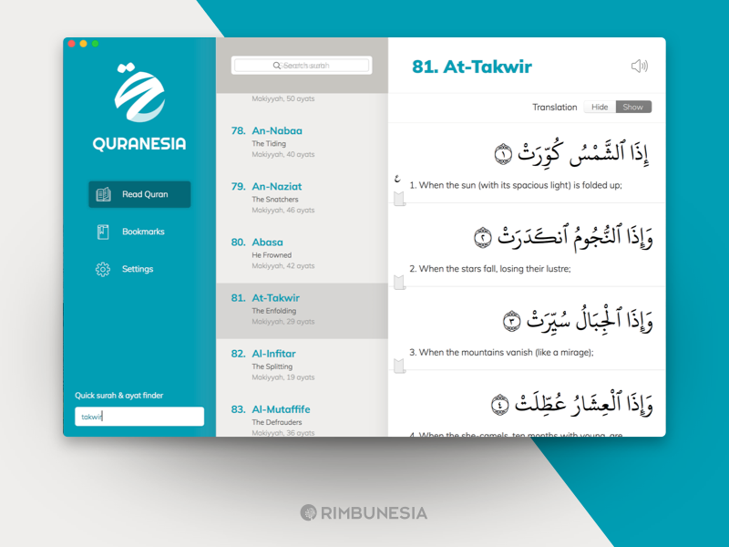

# Quran App

Belajar bareng untuk membuat aplikasi al-quran berbasis web dengan menggunakan Reactjs dan TailwindCss.

Sumber data diperoleh dari API yang disediakan oleh [EQuran.id](https://equran.id).

Referensi Design

---

Made with ♥️